# 数据结构

```mermaid
classDiagram
    %% 基础类
    class ios_base {
        <<base class>>
        +iostate rdstate()
        +void setstate(iostate)
        +void clear(iostate)
        +bool good()
        +bool eof()
        +bool fail()
        +bool bad()
        +fmtflags flags()
        +streamsize precision()
        +streamsize width()
    }

    %% 模板基类
    class basic_ios~CharT, Traits~ {
        <<template class>>
        +char_type fill()
        +void fill(char_type)
        +basic_ostream* tie()
        +basic_streambuf* rdbuf()
        +bool operator!()
        +operator bool()
    }

    %% 输入流
    class basic_istream~CharT, Traits~ {
        <<template class>>
        +basic_istream& operator>>(int&)
        +basic_istream& operator>>(double&)
        +basic_istream& get(char_type&)
        +basic_istream& getline(char_type*, streamsize)
        +basic_istream& read(char_type*, streamsize)
        +streamsize gcount()
        +int peek()
        +basic_istream& ignore()
    }

    %% 输出流
    class basic_ostream~CharT, Traits~ {
        <<template class>>
        +basic_ostream& operator<<(int)
        +basic_ostream& operator<<(double)
        +basic_ostream& put(char_type)
        +basic_ostream& write(char_type*, streamsize)
        +basic_ostream& flush()
        +pos_type tellp()
        +basic_ostream& seekp(pos_type)
    }

    %% 双向流
    class basic_iostream~CharT, Traits~ {
        <<template class>>
        +继承输入输出功能
    }

    %% 文件流基类
    class basic_filebuf~CharT, Traits~ {
        <<template class>>
        +basic_filebuf* open(const char*, ios_base::openmode)
        +basic_filebuf* close()
        +bool is_open()
    }

    class basic_ifstream~CharT, Traits~ {
        <<template class>>
        +basic_ifstream()
        +basic_ifstream(const char*, openmode)
        +void open(const char*, openmode)
        +void close()
        +basic_filebuf* rdbuf()
    }

    class basic_ofstream~CharT, Traits~ {
        <<template class>>
        +basic_ofstream()
        +basic_ofstream(const char*, openmode)
        +void open(const char*, openmode)
        +void close()
        +basic_filebuf* rdbuf()
    }

    class basic_fstream~CharT, Traits~ {
        <<template class>>
        +basic_fstream()
        +basic_fstream(const char*, openmode)
        +void open(const char*, openmode)
        +void close()
        +basic_filebuf* rdbuf()
    }

    %% 字符串流
    class basic_stringbuf~CharT, Traits, Allocator~ {
        <<template class>>
        +basic_string str()
        +void str(const basic_string&)
    }

    class basic_istringstream~CharT, Traits, Allocator~ {
        <<template class>>
        +basic_istringstream()
        +basic_istringstream(const basic_string&)
        +basic_string str()
        +void str(const basic_string&)
        +basic_stringbuf* rdbuf()
    }

    class basic_ostringstream~CharT, Traits, Allocator~ {
        <<template class>>
        +basic_ostringstream()
        +basic_ostringstream(const basic_string&)
        +basic_string str()
        +void str(const basic_string&)
        +basic_stringbuf* rdbuf()
    }

    class basic_stringstream~CharT, Traits, Allocator~ {
        <<template class>>
        +basic_stringstream()
        +basic_stringstream(const basic_string&)
        +basic_string str()
        +void str(const basic_string&)
        +basic_stringbuf* rdbuf()
    }

    %% 具体类型别名
    class istream {
        <<typedef>>
        basic_istream~char~
    }

    class ostream {
        <<typedef>>
        basic_ostream~char~
    }

    class iostream {
        <<typedef>>
        basic_iostream~char~
    }

    class ifstream {
        <<typedef>>
        basic_ifstream~char~
    }

    class ofstream {
        <<typedef>>
        basic_ofstream~char~
    }

    class fstream {
        <<typedef>>
        basic_fstream~char~
    }

    class istringstream {
        <<typedef>>
        basic_istringstream~char~
    }

    class ostringstream {
        <<typedef>>
        basic_ostringstream~char~
    }

    class stringstream {
        <<typedef>>
        basic_stringstream~char~
    }

    %% 宽字符版本
    class wistream {
        <<typedef>>
        basic_istream~wchar_t~
    }

    class wostream {
        <<typedef>>
        basic_ostream~wchar_t~
    }

    class wiostream {
        <<typedef>>
        basic_iostream~wchar_t~
    }

    class wifstream {
        <<typedef>>
        basic_ifstream~wchar_t~
    }

    class wofstream {
        <<typedef>>
        basic_ofstream~wchar_t~
    }

    class wfstream {
        <<typedef>>
        basic_fstream~wchar_t~
    }

    %% 继承关系
    basic_ios --|> ios_base
    basic_istream --|> basic_ios
    basic_ostream --|> basic_ios
    basic_iostream --|> basic_istream
    basic_iostream --|> basic_ostream
    
    basic_ifstream --|> basic_istream
    basic_ofstream --|> basic_ostream
    basic_fstream --|> basic_iostream
    
    basic_istringstream --|> basic_istream
    basic_ostringstream --|> basic_ostream
    basic_stringstream --|> basic_iostream

    %% 类型别名关系
    istream ..|> basic_istream : char特化
    ostream ..|> basic_ostream : char特化
    iostream ..|> basic_iostream : char特化
    ifstream ..|> basic_ifstream : char特化
    ofstream ..|> basic_ofstream : char特化
    fstream ..|> basic_fstream : char特化
    istringstream ..|> basic_istringstream : char特化
    ostringstream ..|> basic_ostringstream : char特化
    stringstream ..|> basic_stringstream : char特化

    wistream ..|> basic_istream : wchar_t特化
    wostream ..|> basic_ostream : wchar_t特化
    wiostream ..|> basic_iostream : wchar_t特化
    wifstream ..|> basic_ifstream : wchar_t特化
    wofstream ..|> basic_ofstream : wchar_t特化
    wfstream ..|> basic_fstream : wchar_t特化
```



# 常用 

|头文件|关键类/对象|数据源/目的地|主要用途|一句话比喻|
|----|----|----|----|----|
|`<iostream>`|`cin, cout, cerr, clog`|	标准设备（键盘、屏幕）|	与用户进行交互式输入输出|	与人对话的窗口|
|`<fstream>`|`ifstream, ofstream, fstream`|	磁盘上的文件|永久性地存储和读取数据|	读写硬盘的笔记本|
|`<sstream>`|`istringstream, ostringstream, stringstream`|内存中的 std::string|格式化字符串、解析字符串、类型转换|内存中的虚拟文件|

## 读写文件 `fstream -> file stream `

- 读文件 `ifstream -> input file stream`

```c++
auto read_file(const std::string & file) -> std::string {
    std::ifstream input(file);
    if (input.is_open()) {
        std::stringstream buffer;
        buffer << input.rdbuf();
        return buffer.str();
    }
    return "";
}
```

- 写文件 `ofstream -> output file stream`

```c++
void write_file(const std::string & file, const std::string & content) {
    std::ofstream out(file);
    if (out.is_open()) {
        out << content;
        out.close();
    }
}
```

## `sstream -> string stream`

- 从字符串读取

```c++
struct User {
    std::string name;
    int age = 0;
    double score = 0;
};

auto from_str(const std::string & str) -> User {
    User user;
    std::istringstream iss(str);
    iss >> user.name;
    iss >> user.age >> user.score;
    return user;
}

    std::string data = "Alice 30 95.5";
    auto && user = from_str(data);
```

- 输出到字符串

```c++
auto to_str(const User & user) -> std::string {
    std::ostringstream oss;
    oss << user.name << "\t";
    oss << user.age << "\t";
    oss << user.score << "\t";
    return oss.str();
}
```

## 格式控制 `<iomanip>`

```c++
auto to_str_V2(const User & user) -> std::string {
    std::ostringstream oss;

    oss << std::left << std::setw(20) << "name" << user.name << "\n";
    oss << std::left << std::setw(20) << "age" << user.age << "\n";
    oss << std::left << std::setw(20) << "score" << user.score << "\n";
    return oss.str();
}
```

- `std::left` 设置左对齐 
- `std::setw(20)` 设置下一个输出的宽度，下一个输出的长度不足则补齐，只对下一个输出有效 


