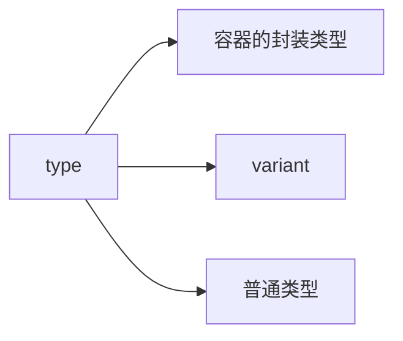

# 迭代器

## 原理

<ins>**当编译器看到 `for (auto& element : container)` 时，它会大致将其转换为如下的等价代码:**</ins>

```C++
auto&& __range = container; // 获取容器引用
auto __begin = std::begin(__range); // 获取起始迭代器
auto __end = std::end(__range);     // 获取结束迭代器
for (; __begin != __end; ++__begin) { // 循环直到结束
    auto& element = *__begin;        // 解引用迭代器获取元素
    // ... 循环体 ...
}
```

## 分类 



## 容器的封装类型

> [!IMPORTANT]
> <ins>**实现`begin/end` 等函数即可**</ins>


```c++
class VecWrap {
public:
    VecWrap(std::initializer_list<int64_t> list)
        : data_(list) {}

    auto begin() -> std::vector<int64_t>::iterator { return data_.begin(); }

    auto end() -> std::vector<int64_t>::iterator { return data_.end(); }

    [[nodiscard]] auto begin() const -> std::vector<int64_t>::const_iterator { return data_.begin(); }

    [[nodiscard]] auto end() const -> std::vector<int64_t>::const_iterator { return data_.end(); }

    [[nodiscard]] auto size() const -> size_t { return data_.size(); }

    [[nodiscard]] auto empty() const -> bool { return data_.empty(); }

private:
    std::vector<int64_t> data_;
};
```

## `variant`

```C++
struct Items {
    using ItemVec = std::variant<
        std::monostate,
        std::vector<Item1Ptr>,
        std::vector<Item2Ptr>,
        std::vector<Item3Ptr>,
        std::vector<Item4Ptr>>;

    ItemVec vec_;
};

void Items::range() {
    std::visit(
        [&](const auto& vec) {
            using VectorType = std::decay_t<decltype(vec)>;

            if constexpr (std::is_same_v<std::vector<Item1Ptr>, VectorType>)
            {
                LOG(INFO) << "Content of vector<A>:" << std::endl;
                for (const Item1Ptr& item : vec)
                {
                    LOG(INFO) << "is a. " << item->ida << " " << item->namea;
                }
            } else if constexpr (std::is_same_v<std::vector<Item2Ptr>, VectorType>)
            {
                LOG(INFO) << "Content of vector<A>:" << std::endl;
                for (const Item2Ptr& item : vec)
                {
                    LOG(INFO) << "is b. " << item->idb << " " << item->nameb;
                }
            } else if constexpr (std::is_same_v<std::vector<Item3Ptr>, VectorType>)
            {
                LOG(INFO) << "Content of vector<A>:" << std::endl;
                for (const Item3Ptr& item : vec)
                {
                    LOG(INFO) << "is c. " << item->idc << " " << item->namec;
                }
            } else if constexpr (std::is_same_v<std::vector<Item4Ptr>, VectorType>)
            {
                LOG(INFO) << "Content of vector<A>:" << std::endl;
                for (const Item4Ptr& item : vec)
                {
                    LOG(INFO) << "is d. " << item->idd << " " << item->named;
                }
            }
        },
        vec_);
}
```

## 普通类型

> [!IMPORTANT]
> <ins>**实现 容器类 (Container Class)：负责存储数据和状态**</ins>
> <ins>**迭代器类 (Iterator Class)：一个独立的类（通常作为容器的嵌套类），它知道如何在容器中导航（移动到下一个元素）并访问当前元素**</ins>

### step1
> [!IMPORTANT]
> <ins>**定义容器和迭代器的基本结构**</ins>

```C++
template <typename T, size_t N>
class FixedArray {
private:
    T data_[N];
    size_t size_;

public:
    FixedArray()
        : size_(0) {}

    // 内部迭代器类
    class iterator {
    public:
        using iterator_category = std::random_access_iterator_tag; // 1. 类别：这是最强大的，支持随机访问
        using value_type = T; // 2. 所指元素的类型
        using difference_type = std::ptrdiff_t; // 3. 两个迭代器相减的结果类型
        using pointer = T*; // 4. 指向元素的指针类型
        using reference = T&; // 5. 解引用返回的引用类型
    };
};
```

### step2
> [!IMPORTANT]
> <ins>**实现迭代器类 (iterator)**</ins>

```C++
    class iterator {
    public:
        using iterator_category = std::random_access_iterator_tag; // 1. 类别：这是最强大的，支持随机访问
        using value_type = T; // 2. 所指元素的类型
        using difference_type = std::ptrdiff_t; // 3. 两个迭代器相减的结果类型
        using pointer = T*; // 4. 指向元素的指针类型
        using reference = T&; // 5. 解引用返回的引用类型

    public:
        explicit iterator(pointer ptr)
            : ptr_(ptr) {}

        // --- 核心操作符 ---
        // 1. 解引用 (Dereference) -> 获取元素
        auto operator*() const -> reference { return *ptr_; }
        auto operator->() const -> pointer { return ptr_; }


        // 2. 前置递增 (Prefix Increment) -> 移动到下一个
        auto operator++() -> iterator& {
            ++ptr_;
            return *this;
        }
        // 后置递增 (Postfix Increment)
        auto operator++(int) -> iterator {
            iterator temp = *this;
            ++(*this);
            return temp;
        }


        // 3. 比较 (Comparison) -> for循环的终止条件
        auto operator==(const iterator& other) const -> bool { return ptr_ == other.ptr_; }
        auto operator!=(const iterator& other) const -> bool { return ptr_ != other.ptr_; }

        // --- (可选) 为 random_access_iterator_tag 提供更多操作符 ---
        auto operator--() -> iterator& {
            --ptr_;
            return *this;
        }
        auto operator--(int) -> iterator {
            iterator temp = *this;
            --(*this);
            return temp;
        }
        auto operator+=(difference_type offset) -> iterator& {
            ptr_ += offset;
            return *this;
        }
        auto operator+(difference_type offset) const -> iterator {
            iterator temp = *this;
            temp += offset;
            return temp;
        }
        auto operator-=(difference_type offset) -> iterator& {
            ptr_ -= offset;
            return *this;
        }
        auto operator-(difference_type offset) const -> iterator {
            iterator temp = *this;
            temp -= offset;
            return temp;
        }
        auto operator-(const iterator& other) const -> difference_type { return ptr_ - other.ptr_; }
        auto operator[](difference_type offset) const -> reference { return ptr_[offset]; }
        auto operator<(const iterator& other) const -> bool { return ptr_ < other.ptr_; }

    private:
        pointer ptr_;
    };
```

### step3 

> [!IMPORTANT]
> <ins>**在容器中实现 begin() 和 end()**</ins>

```C++
public:
    iterator begin() {
        return iterator(data_); // 创建一个指向数组头部的迭代器
    }

    iterator end() {
        return iterator(data_ + N); // 创建一个指向数组末尾之后一个位置的迭代器
    }
```

### step4 
> [!IMPORTANT]
> <ins>**const 正确性 - 实现 const_iterator**</ins>

```C++
public:
    // (接在 iterator 类定义之后)
    class const_iterator {
        // 实现与 iterator 类似, 但所有返回的引用和指针都是 const
    public:
        using iterator_category = std::random_access_iterator_tag;
        using value_type        = T;
        using difference_type   = std::ptrdiff_t;
        using pointer           = const T*; // 注意这里是 const
        using reference         = const T&; // 注意这里是 const

    private:
        pointer ptr_;

    public:
        explicit const_iterator(pointer ptr) : ptr_(ptr) {}

        reference operator*() const { return *ptr_; }
        const_iterator& operator++() { ++ptr_; return *this; }
        bool operator!=(const const_iterator& other) const { return ptr_ != other.ptr_; }
    };


    // --- 非 const 版本，返回可修改的迭代器 ---
    iterator begin() { return iterator(data_); }
    iterator end()   { return iterator(data_ + N); }

    // --- const 版本，返回只读的迭代器 ---
    const_iterator begin() const { return const_iterator(data_); }
    const_iterator end() const   { return const_iterator(data_ + N); }

    // --- 显式的 const 版本 (最佳实践) ---
    const_iterator cbegin() const { return const_iterator(data_); }
    const_iterator cend() const   { return const_iterator(data_ + N); 
}
```
