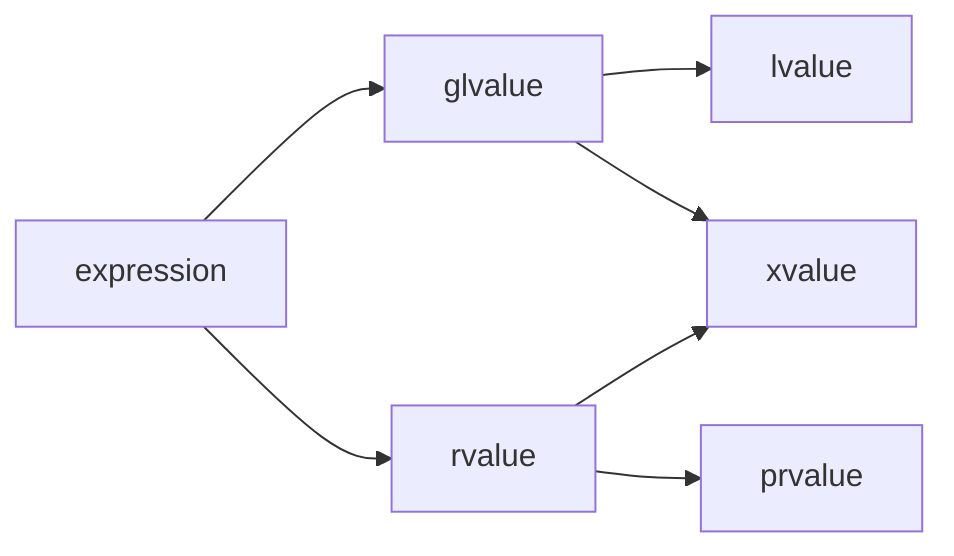
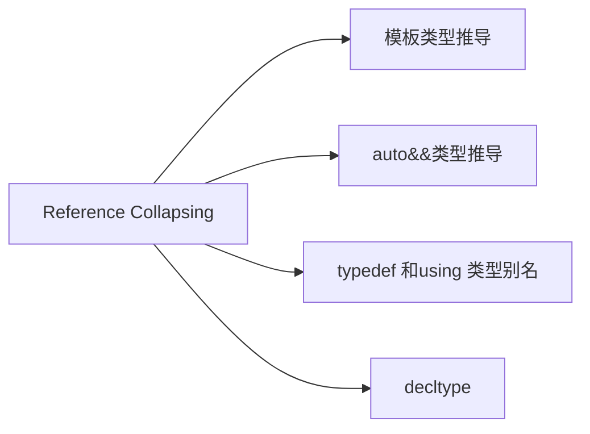

# value

## 分类



- glvalue = lvalue + xvalue , 有identity, 可以被取地址
- rvalue = xvalue + prvalue , 可以移动

## 如何区分

> [!Tip]
> 1. 有名字(`identity`)的都是左值, 即便是右值引用 变量本身,当它被用作表达式时,也是左值
> 2. 可以被取地址的,都是左值
> 3. <ins>**字符串字面量是左值**</ins>,<ins>**其他字面量(42/MyClass{})是右值**</ins>
> 4. `std::move(arg) `的结果是 `xvalue`
> 5. 临时对象 `MyClass()` 是 `prvalue`


## 函数返回值

1. <ins>**返回左值引用 (T& func())：结果是 lvalue.**</ins>
2. <ins>**返回右值引用 (T&& func())：结果是 xvalue.**</ins>
3. <ins>**返回非引用类型/值类型 (T func())：结果是 prvalue.**</ins>


## 字符串字面量

> [!IMPORTANT]
> `"hello world"` 是左值

- 字符串字面量在程序编译后，会被存储在内存的特定区域（通常是只读数据段）。这意味着它们有一个确定的内存地址
- 左值的核心特征之一就是它标识了一个对象或函数，你可以获取它的地址。对于字符串字面量,可以取地址
```C++
const char (*ptr_to_array)[6] = &"hello";
```
- 非临时性 (Not a Temporary Value in the prvalue sense) , 与 42 或 MyClass() (一个未命名的临时对象) 不同，字符串字面量不是在表达式求值时即时创建然后销毁的“纯粹”值。它指向的是预先分配好的、持久的数据


## xvalue (将亡值)

<ins>**有身份的右值,既可以像左值一样标识一个对象,又可以像右值一样,被move**</ins>

- `std::move(some_lvalue)`: 这是最常见的产生将亡值的方式.`std::move` 将一个`左值 some_lvalue` 转换为一个 xvalue，告诉编译器：“你可以把 some_lvalue 当作右值来对待，以便调用移动构造函数或移动赋值运算符。”
- 函数返回右值引用: `MyType&& foo() { MyType t; /* ... */ return std::move(t); }`
- 访问右值对象的非静态数据成员: `std::string str = MyClass().data;`


# 如何绑定

## `T`是普通类型

| 实参类型       | `func(T arg)`                | `func(T& arg)` | `func(const T& arg)` | `func(T&& arg)`               |
| -------------- | ---------------------------- | -------------- | -------------------- | ----------------------------- |
| `lvalue `      | ✅ 可以 (会发生拷贝/移动构造) | ✅ 可以         | ✅ 可以               | ❌不可以 (除非主动`std::move`) |
| `const lvalue` | ✅ 可以 (会发生拷贝构造)      | ❌不可以        | ✅ 可以               | ❌不可以 (除非主动`std::move`) |
| `prvalue`      | ✅ 可以 (会发生拷贝/移动构造) | ❌不可以        | ✅ 可以               | ✅ 可以                        |
| `xvalue`       | ✅ 可以 (会发生拷贝/移动构造) | ❌不可以        | ✅ 可以               | ✅ 可以                        |


## `T`是模板

| 实参类型       | `func(T arg)`                    | `func(T& arg)` | `func(const T& arg)` | `func(T&& arg)`                  |
| -------------- | -------------------------------- | -------------- | -------------------- | -------------------------------- |
| `lvalue `      | ✅ 可以 (会发生拷贝/移动构造)     | ✅ 可以         | ✅ 可以               | ✅ 可以 (万能引用折叠为 T&)       |
| `const lvalue` | ✅ 可以 (会发生拷贝构造)          | ❌不可以        | ✅ 可以               | ✅ 可以 (万能引用折叠为 const T&) |
| `prvalue`      | ✅ 可以 (会发生拷贝/移动构造优先) | ❌不可以        | ✅ 可以               | ✅ 可以                           |
| `xvalue`       | ✅ 可以 (会发生拷贝/移动构造优先) | ❌不可以        | ✅ 可以               | ✅ 可以                           |

# 引用折叠

> 确保forward时类型可以正确推导

<ins>**所有情况下，如果任一引用是左值引用 (&)，则结果是左值引用。只有当所有涉及的引用都是右值引用 (&&) 时，结果才是右值引用.**</ins>


## 场景 




```c++
template<typename T>
void func(T&& param); // 这里的 T&& 是一个转发引用 (也叫万能引用)
```

## lvalue

```C++
int x = 10;
func(x); 

// T 被推导为 int& (左值引用类型)
// param 的类型变成 T&& => (int&) &&
// 根据引用折叠规则 (& + && -> &)，param 的实际类型是 int&
```

## prvalue

```c++
func(20); // 20 是 int 类型的右值 (prvalue)

// T 被推导为 int (非引用类型) 
// param 的类型变成 T&& => (int) &&
// 这不需要折叠，param 的实际类型就是 int&&
```

## xvalue

```c++
int y = 30;
func(std::move(y)); // std::move(y) 是 int 类型的右值 (xvalue)

// T 被推导为 int (非引用类型)。
// param 的类型变成 T&& => (int) &&。
// param 的实际类型是 int&&。
```