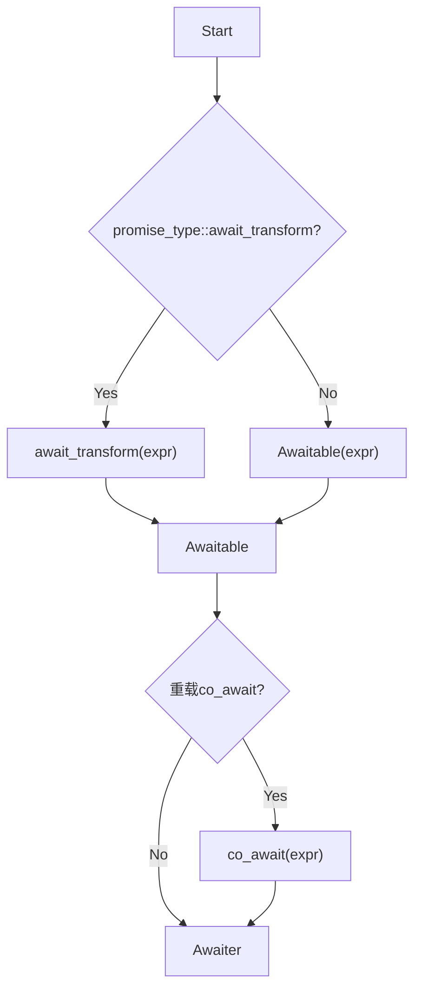
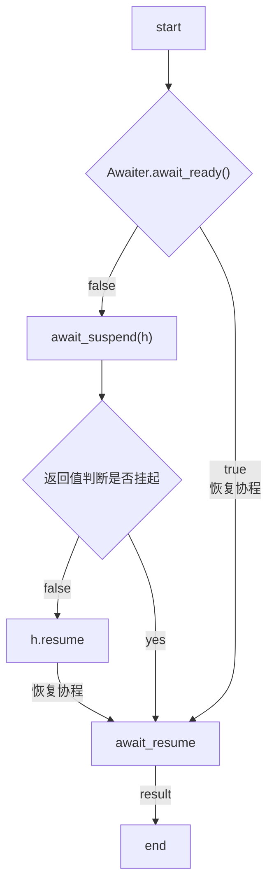

# 协程实现细节

- [协程实现细节](#协程实现细节)
- [协程的生命周期](#协程的生命周期)
  - [`promise_type`](#promise_type)
  - [协程类](#协程类)
  - [`coroutine_handle`](#coroutine_handle)
- [协程的调度](#协程的调度)
  - [`co_await`](#co_await)
  - [`co_yield`](#co_yield)


# 协程的生命周期 


1. 调用函数在**堆**上，创建协程帧(`coroutine_frame`)，里面包含了协程的`promise_type`,协程的实参，当前保存的局部变量，协程内部状态如挂起点. 由编译器实现
2. 创建协程帧之后，会返回给调用者`coroutine_handle`,也叫协程句柄，是控制协程的唯一入口，可以被传递到其他地方
3. 调用被调用协程，协程开始执行
4. 被调用协程执行到某个特定点，通过`co_await/co_yield` 将当前协程休眠，调用者恢复原本的执行流程继续执行剩余代码
5. 协程恢复者（比如另一个线程）通过`coroutine_handle`的恢复函数`resume` 恢复协程执行
6. 协程在恢复者上继续执行，结束后通过 `coroutine_handle` 销毁协程帧。

** 这里的协程并不是常规函数在栈上执行，他们的状态在堆上（一开始创建的协程帧）**

## `promise_type`

> 与标准库的promise 不是一回事

按照`concept`的概念，约束如下

```cpp
template <typename P, typename V>
concept PromiseType = requires(P p) {
    { p.get_return_object() } -> Coroutine<P>;
    { p.initial_suspend() } -> Awaiter; // 第一个挂起点
    { p.final_suspend() } -> Awaiter; // 最后一个挂起点
    { p.yield_value() } -> V;

    { p.unhandled_exception() } // 异常处理

    requires(
        requires(V v) { p.return_value(v); } || requires { p.return_void(); });
};
```

```cpp
struct PromiseType {
    // 第一个挂起点
    initial_suspend()
    // 最后一个挂起点
    final_suspend()
    // 异常处理
    unhandled_exception()
    get_return_object()
    // 如果coroutine最后返回的是void
    return_void()
    // 如果coroutine最后返回的是值 （和上面的不能同时存在）
    return_value()
    // 如果coroutine里面有co_yield
    yield_value()
}
```

## 协程类 

> 一个协程类，必须满足一下约束 

```cpp

struct Coroutine {
    // 必须满足上述的约束 
    typename promise_type pt;
    // 外部操作协程时使用 可以挂起/恢复协程
    typename coroutine_handle handle;
    // 协程生命周期中的变量和参数
    typename coroutine_state cs;
};

```

## `coroutine_handle`


# 协程的调度

## `co_await`

> `co_await` / `co_yield`

`co_await` 操作符用于休眠协程，并将控制权返还给协程调用者.

```cpp
co_await expr;
```

`expr`(表达式)需要满足的条件如下:

1. 表达式类型定义了 `co_await`操作符重载 
2. 可以通过当前协程的 `promise_type::await_transform` 转换为定义了 `co_await` 操作符的类型
3. 只能出现在函数体的执行表达式中，不能出现在异常处理、声明语句、简单声明表达式、默认参数和带 `static` 和 `thread_local` 的局部变量定义中

**表达式的转换过程**



也就是`co_await expr` 最终产生一个 `Awaiter`对象，`Awaiter`对象的执行逻辑如下 




## `co_yield`

> `co_await` 的语法糖, 用于生成器场景： 通过生成或者其他数据源来生成某种序列

```cpp
// 这两个是相等的
co_yield expr;

co_await promise.yield_value(expr);

```